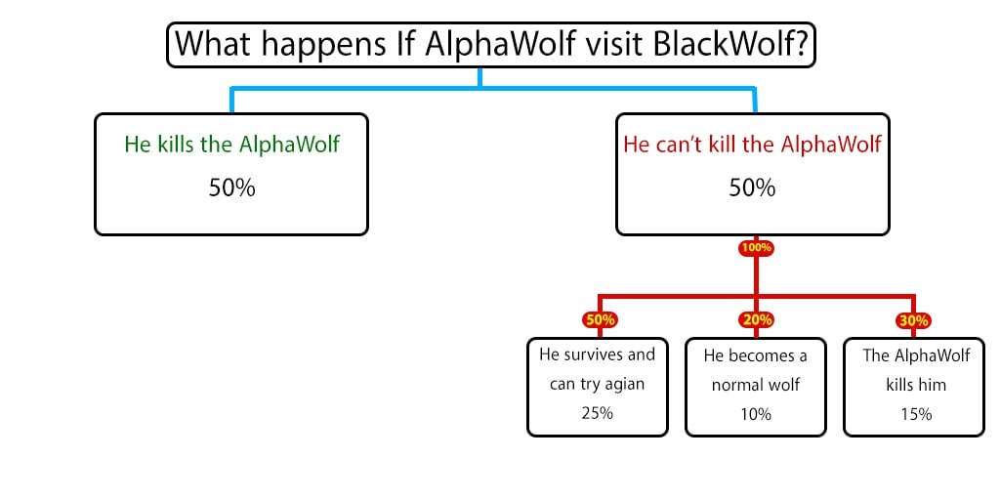

# 狼人殺角色列表

溫馨提示：權重僅供參考

### 村民隊伍

#### 村民 👱‍♂️｜Villager (VG)

> 角色權重：1

> 你的角色很簡單，努力活下去，不犯蠢的選出狼人處死他。

- 你在日間或夜間都沒有行動
- 偷竊成功率：100%
- 傳教成功率：100%
- 強襲模式不會出現

#### 酒鬼 🍻｜Drunk

> 角色權重：3

> 身為一個酒鬼，你依然是個村民，你唯一的作用就是在被狼人吃掉時用你那高的嚇死人的血液酒精濃度讓那狼人們下次殺人行動醉得不能殺人。

- 你在日間或夜間都沒有行動
- 偷竊成功率：75%
- 傳教成功率：100%

#### 先知 👳‍♂️｜Seer

> 角色權重：7，如果有旁觀者則為 10

> 你每天晚上可以透過水晶球看見一個人的真實身分，小心你的身分，如果你暴露了，狼人會嘗試去殺你。

- 🌃 你在夜間有行動
- 先知無法得知到底是何種狼，只能確定他是[狼人](#狼人)
- 先知會把[偽狼人](#偽狼人)看成[狼人](#狼人)，[偽村民](#偽村民)看成[村民](#村民)
- 先知有 50% 的機率把[叛徒](#叛徒)看成[狼人](#狼人)，另外 50% 是普通的[村民](#村民)
- 偷竊成功率：25%
- 傳教成功率：40%

#### 妓女 💋｜Harlot

> 角色權重：6

> 身為一個妓女（你這蕩婦）你每晚都可以選擇訪問一個玩家來滿足你的欲求不滿。如果他不是狼，那你會活下來，如果你爬上狼人的床，你會在高潮中死去。如果你爬上一個被狼人光顧的玩家家，那你也會被一起吃掉。但如果你當晚出去享樂狼人找上了你，那你會因此逃過一劫（因為你不在家）。

- 🌃 你在夜間有行動
- 如果你拜訪狼或[殺人魔](#殺人魔)，你會被殺死
- 如果你拜訪狼群或殺人魔選擇殺死的玩家，你也會被殺死
- - 但是如果你去拜訪玩家，而狼群選擇殺了你，你會活下來（因為你不在家）
- - 但即使你不在家，殺人魔也能殺了你
- 你有 50% 的機會發現你的枕邊人是[邪教徒](#邪教徒)
- 偷竊成功率：50%
- 傳教成功率：70%（待在家中時）

#### </a>旁觀者 👁｜Beholder (BH)

> 角色權重：如果有[先知](#先知)則為 6，沒有則為 2

> 旁觀者清，你一開始就知道誰才是真正的先知，而不是假的先知。

- 你在日間或夜間都沒有行動
- 偷竊成功率：75%
- 傳教成功率：100%

#### 槍手 🔫｜Gunner

> 角色權重：6

> 手握板機的快感很爽？身為一個槍手你有兩枚銀子彈，每天你都可以選一個玩家槍斃。但是一但你開了第一槍，所有人都知道你是槍手。注意，你只有兩枚子彈。

- 🏙 你在日間有行動
- 偷竊成功率：75%
- 傳教成功率：100%

#### 守護天使 👼｜Guardian Angel (GA)

> 角色權重：7

> 你是保護人的天使，每天晚上你可以選擇一個玩家守護他。小心！如果守護一個狼人你有 50% 機率被他給吃了。

- 🌃 你在夜間有行動
- 如果你守護狼，則有 50% 的機會被咬死
- 如果你守護[殺人魔](#殺人魔)，你會被殺死
- 如果[狼王](#狼王)感染了你，你將成為[墮落天使](#墮落天使)
- 在你守護完回家睡覺時（你畢竟是人）還是會被狼人吃掉
- 守護天使無法阻止[痴漢跟蹤狂](#痴漢跟蹤狂)攻擊（因為癡漢跟蹤狂攻擊時被害人還沒回到家）
- 偷竊成功率：50%
- 傳教成功率：60%（待在家中時）

#### 傻瓜 🃏｜Fool

> 角色權重：2，一說 3

> 傻瓜一開始會以為自己是[先知](#先知)，當看著水晶球，水晶球會隨機告知這個玩家是任何一個可能的角色，而你還相信你真的是先知，因為你就是個傻瓜。

- 🌃 你在夜間有行動
- 當看著水晶球，水晶球會隨機告知這個玩家是任何一個可能的角色，而這個角色必出現在遊戲中。
- 傻瓜可能看到逝去的角色（20210618）
- 傻瓜仍然有正確的可能性
- 偷竊成功率：75%
- 傳教成功率：100%

#### 磚瓦工 👷‍♂️｜Mason

> 角色權重：如果只有一個人為 1，一個以上則為 3 + 人數

> 磚瓦工其實跟村民沒甚麼兩樣，不過他知道誰跟他是一樣的辛苦的磚瓦工，除此之外你就是村民。
>
> 備註：當你的磚瓦工朋友沒來每天的會議，你會知道他再也不是你的同伴了！

- 你在日間或夜間都沒有行動
- 偷竊成功率：75%
- 傳教成功率：100%

#### 偵探 🕵️‍♂️｜Detective

> 角色權重：5

> 你是個年邁的老偵探。每天白天你有機會去調查其他玩家，雖然你非常的小心，但是你還是有 40% 的機會被[狼人](#狼人)注意到你是鬼鬼祟祟的偵探行為。

- 🏙 你在日間有行動
- 偷竊成功率：40%
- 傳教成功率：70%

#### 先知學徒 🙇‍♂️｜Apprentice Seer (AppS)

> 角色權重：6

> 你暫時只是一個普通村民，但如果先知死了，你將繼承你師父的宿業成為新的[先知](#先知)。

- 如果你第一天就「拿到塔羅牌」成為[先知](#先知)，代表這局開局時根本不存在[先知](#先知)
- 你在日間或夜間都沒有行動
- 偷竊成功率：50%
- 傳教成功率：100%

#### 邪教獵人 💂‍♂️｜Cultist Hunter (CH)

> 角色權重：如果有邪教徒則為 7，無則為 1

> 你的職責就是獵殺所有的邪教徒，如果有教徒試圖轉換你，那麼邪教徒的最新成員會死亡，每天晚上你可以選擇一個玩家來獵殺，只要他是邪教徒，他就會被你所殺死。

- 🌃 你在夜間有行動
- 偷竊成功率：25%
- 30% 的機率殺死[小偷](#小偷)
- 邪教無法轉換你
- 如果[邪教徒](#邪教徒)嘗試傳教，你會反殺他並且知道剩下幾個邪教徒
- 當邪教獵人因為未投票而被系統殺死時，如果群組啟用了邪教獵人替換，機器人將會把[村民](#村民)、[蠢蛋](#蠢蛋)、[狼](#狼)、[傻瓜](#傻瓜)、[酒鬼](#酒鬼)、[旁觀者](#旁觀者)的其中一人變成邪教獵人。
- 由於先獵殺後傳教，故邪教獵人不可能查的到當天傳教成功的邪教徒

#### 邱比特 🏹｜Cupid

> 角色權重：2

> 身為邱比特，你將可以選擇兩個玩家成為至死不渝的戀人，這兩名玩家會瘋狂地愛上彼此。如果其中一個死了。另外一個也會因為哀傷過度而死去。

- 邱比特除了射出愛神箭外，就是個村民
- 戀人會知道彼此是誰，但是不知道彼此的身分
- 如果戀人是最後兩個活下的角色則不管他們是甚麼隊伍，都算戀人獲勝
- 如果戀人是不同隊伍（村民+狼），任何一個隊伍贏了（狼），那麼戀人（村民隊伍那位）也贏了
- 只要遊戲結束時，其中一個戀人在贏的隊伍，那麼另外一個戀人也算贏了
- 偷竊成功率：75%
- 傳教成功率：100%

#### 獵人 🎯｜Hunter

> 角色權重：6

> 身為一個獵人，你是一個板機狂熱且高復仇心的玩家。你總是遠離人群，但是當別人來探望你，他們可能會因為你的偏執疑心而死於你的槍口下。

- 你在日間或夜間都沒有行動
- 如果狼群攻擊你，你有機會殺死其中一隻狼，其他情況下你有機會在你死之前射殺一個人。
- - 當一隻狼攻擊時。你有 30% 機會殺死狼並活下來。
- - 每增加一個狼增加 20% 殺死狼的機率（2 頭狼 = 50%，3 頭狼 = 70%）。
- - 但是因為多對一的關係，雖然你或許可以殺死其中一隻狼，但是你依然會被數量優勢給殺死。 （這個機率上升了，但無法得知實際數值是多少 https://t.me/BlackWolfAnnouncements/542 ）
- 偷竊成功率：50%
- - 失敗時 50% 的機率殺死小偷
- 傳教成功率：50%
- - 失敗時 25% 的機率殺死邪教徒

#### 蠢蛋 🤕｜ClumsyGuy

> 角色權重：-1

> 你是個蠢蛋，或許當初不應該在早餐喝下那麼多酒，你的眼睛該死的啥都看不清了。你還能投票給你想要處決的人嗎？（你有一半的機率投錯要處決的村民而不是你心中所想的那位）

- 你在日間或夜間都沒有行動
- 偷竊成功率：100%
- 傳教成功率：100%
- 強襲模式不會出現
- 遊戲群長期禁用角色之一

#### 鐵匠 ⚒｜Blacksmith

> 角色權重：如果沒有狼則為 2，有狼則為 3，此時如果同時有[睡魔](#睡魔)或[暴風使者](#暴風使者)在場則為 5

> 你是鐵匠。經年累月下來，你平常打造的刀劍沒有一件能夠讓你滿意，唯獨精靈們拜託你打造的銀匕首令你自豪。你似乎還留有些許的當時殘餘些許銀渣，那些銀渣或許能夠阻止狼群的行動一個夜晚也說不定呢。

- 🏙 你在日間有行動
- 偷竊成功率：50%
- 傳教成功率：75%

#### 王子 💍｜Prince

> 角色權重：3

> 王子在村民陣營策略扮演著關鍵性的角色。一旦王子被處決，王子的身份將會揭開，並活下來。但是也表示這只會發生一次，如果村民依然再次選擇處決王子，那王子將會被處決而死。

- 你在日間或夜間都沒有行動
- 一人[磚瓦工](#磚瓦工)將會被轉換成王子（僅強襲模式，換句話說強襲模式一局可能出兩個王子）（20240921，以前是轉換成[被詛咒的人](#被詛咒的人)）
- 偷竊成功率：75%
- 傳教成功率：100%

### 村長 🎖｜Mayor

> 角色權重：4

> 身為村長，你想當然爾是村民的一份子，當你揭露了你的真實身份，你的意見將會受到村民的重視，換言之在處決投票時，你的一票將等於兩票，善用你的權利去帶領你的村民吧！

- 🏙 你在日間有行動
- 偷竊成功率：75%
- 傳教成功率：100%

#### 半仙 🌀｜Oracle

> 角色權重：4

> 半仙每晚可以查看一名玩家，查看結果將會顯示（玩家）不是（隨機顯示場內生存角色）。

- 🌃 你在夜間有行動
- 偷竊成功率：50%
- 傳教成功率：50%

#### 君王 👑｜Monarch

> 角色權重：4

> 沒有人知道這位君王是怎樣來到這個村莊的，聽說是因說他的馬車壞了。身作皇族的一員，你擁有一天至高無上的權力，可以在投票階段決定誰要處決。

- 🏙 你在日間有行動
- 偷竊成功率：75%
- 傳教成功率：100%

#### 和平主義者 ☮️｜Pacifist

> 角色權重：3

> 身為一個熱愛和平的人士，和平主義者不能容忍村莊內任何的暴力。因此每一場遊戲中，你有一次機會向任何人宣場愛和自由的重要性，宣揚當天村莊將無法投票。

- 🏙 你在日間有行動
- 偷竊成功率：50%
- 傳教成功率：80%

#### 老賢者 📚｜Wise Elder

> 角色權重：6

> 在老賢者的漫長的人生中，遇見過很多有害和無害的人們，累積下來的智慧使他可以每天查看一個人，他們是否有害，和是否具備能力去殺害他人。

- 🏙 你在日間有行動
- 老賢者可以看到以下角色有能力殺人：
- - [縱火犯](#縱火犯)
- - [黑狼](#黑狼)
- - [邪教獵人](#邪教獵人)
- - [墮落天使](#墮落天使)
- - [槍手](#槍手)
- - [獵人](#獵人)
- - [殺人魔](#殺人魔)
- - [痴漢跟蹤狂](#痴漢跟蹤狂)（40%）
- - [人偶師](#人偶師)（20%）
- - 狼 🐺
- 偷竊成功率：50%
- 傳教成功率：30%

#### 睡魔 💤｜Sandman

> 角色權重：1，如果同時有[鐵匠](#鐵匠)在場則為 3

> 睡魔擁有一次使所有玩家沉睡的能力，使得當晚沒有玩家能夠行動。

- 🏙 你在日間有行動
- 睡魔不會和[暴風使者](#暴風使者)出現在同一遊戲中（僅正常模式與強襲模式）（20210618）
- 偷竊成功率：50%
- 傳教成功率：60%

#### 偽狼人 👱‍♂️🌚｜Wolf Man

> 角色權重：-1

> 偽狼人身為村民，卻擁有粗曠體格與茂盛體毛，因此先知會將把你誤認成狼人。

- 你在日間或夜間都沒有行動
- 偷竊成功率：100%
- 傳教成功率：100%
- 強襲模式不會出現

#### 烈士 🔰｜Martyr

> 角色權重：0

> 在每次遊戲開始時，你將會選擇一個角色並成為他的替死鬼，如果那個人死亡，你將為他而死去，而那個人將會生還。在你死亡之前，你將會是村民陣營之一；但當你為某人而犧牲，則只有那個人勝利你才能獲勝。

- 🌃 你在夜間有行動
- 如果你不是因為犧牲而死，除非你是戀人否則你實質上必定輸掉
- 無人勝時自動獲勝
- 如果你還活著且你的替死鬼的陣營獲勝你也會一起獲勝
- 偷竊成功率：50%
- 傳教成功率：60%
- 遊戲群長期禁用角色之一

#### 煉金術士 🍵｜Alchemist

> 角色權重：8

> 煉金術士一直沉浸在釀造的魔力之中，終於找到了解除狼人魔咒的方法。但這個棘手的藥水需要釀造三個晚上才能完成，而且散發著強烈的氣味，使狼人有 20% 的機率發現你。更糟糕的是，如果你將藥水錯手交予村民，他將突變成狼人並殺死你。

- 🌃 你在夜間有行動（配置藥水）
- 🏙 你在日間有行動（交予藥水）
- ~~實際上，配置藥水花的時間是 3× 當前村莊裡的狼的數量 個晚上，亦即若是藥水一天就配置好代表當前村莊內根本沒有狼~~（20241018 失效）
- 狼人數量增加會使得藥水無效
- 偷竊成功率：75%
- 傳教成功率：50%

#### 侍衛 🛡｜Squire

> 角色權重：4

> 侍衛一直跟隨在邪教獵人身後學習，如果邪教獵人不幸逝世，邪教獵人侍衛將繼承他的衣缽成為新的邪教獵人。

- 你在日間或夜間都沒有行動
- 偷竊成功率：50%
- 傳教成功率：25%

#### 美女 💅｜Beauty

> 角色權重：3

> 美女是村莊裡最漂亮和善良的村民，假若有任何夜間的角色試圖拜訪或殺死美女，他們都會拜倒在美女的美色之下並和美女成為戀人。此外，如果美女有老戀人，老戀人則會因為過分悲傷而死去！因此在晚上，除了因為被愛情矇閉了雙眼的戀人殺死外，美女幾乎是無法被殺死的。

- 你在日間或夜間都沒有行動
- 狼群吃美女時，會有隨機一隻狼成為戀人
- 若美女連續被狼人咬兩次或連續被殺人魔殺兩次，美女依然會死
- 可能拜訪美女的角色（按拜訪順序排序）
- 1. 狼
- 2. [殺人魔](#殺人魔)
- 3. [邪教獵人](#邪教獵人)
- 4. 邪教徒（邪教的最新成員）
- 5. [妓女](#妓女)
- 6. [守護天使](#守護天使)
- 7. [小偷](#小偷)
- 8. [黑狼](#黑狼)
- 9. [潛行者](#潛行者)
- 偷竊成功率：100%（如果小偷已和美女成為戀人）
- 傳教成功率：100%（如果傳教的邪教徒已和美女成為戀人）

#### 暴風使者 🌩｜Storm Bringer

> 角色權重：4，如果同時有[鐵匠](#鐵匠)在場則為 6

> 暴風使者作為掌控風雨的人，可以在晚上召喚一場可怕的風暴，風暴之狂野使所有夜間行動的角色都會乖乖留在家中，並且無法進行任何行動。風暴不限時間，夜晚的任何時間都可召喚。

- 🌃 你在夜間有行動
- 暴風使者不會和睡魔出現在同一遊戲中（僅正常模式與強襲模式）（20210618）
- 偷竊成功率：50%
- 傳教成功率：65%

#### 心智操縱者（暫譯）🧠｜MindBender

> 角色權重：未知

> 新增時間：20241018

> 作為心智操縱者，你擁有一項獨特且強大的能力——改變其他玩家的意志。憑藉這種力量，你可以將任何非村民轉變為村民，使他們站到你這邊並壯大村莊的力量。但要小心！你的影響力十分脆弱。一旦你死亡，所有受到你控制的玩家都會恢復原來的身份，可能使局勢逆轉，對村莊構成威脅。你的生存是維持控制並確保村莊勝利的關鍵。你會選擇操縱他人的心智，還是任由命運反過來操縱你？

- 每個角色被心智操縱的可能性有所不同，這些機率仍在調整中，從現有村民的 0% 到某些角色的 20% 甚至 70% 不等。
- 對象被控制期間被視作[村民](#村民)。
- 已控制的人會暫時從可控制列表消失，失去控制後就會重新列出來。
- 偷竊成功率：0%
- - 必定殺死小偷
- 傳教成功率：0%（並且也無法被[邪教大祭司](#邪教大祭司)增加成功率）
- - 必定殺死邪教徒

### 可能轉變成狼的村民隊伍

俗稱「預備隊」

#### 叛徒 🖕｜Traitor

> 角色權重：0

> 你這個牆頭草，如果你能活到所有的狼都死掉，你將會成為全新的一隻[狼人](#狼人)，並準備對你的前隊友展開獵殺。

- 你在日間或夜間都沒有行動
- [先知](#先知)有 50% 的機率把[叛徒](#叛徒)看成[狼人](#狼人)，另外 50% 是普通的[村民](#村民)
- 偷竊成功率：75%
- 傳教成功率：100%
- 強襲模式不會出現

#### 孤兒 👶｜Wild Child (WC)

> 角色權重：1

> 在遊戲開始的時候，你可以選一個玩家作為你的「偶像」。如果你的偶像死亡，你將變身為[狼人](#狼人)！

- 偷竊成功率：50%
- 傳教成功率：100%

#### 被詛咒的人 😾｜Cursed

> 角色權重：如果沒有狼則為 1，有一隻以上的狼則更低

> 身為一個被詛咒之人，你暫時只是個普通村民。然而當你被狼人咬到時，你將成為他們最新的成員。

- 你在日間或夜間都沒有行動
- 你無法得知自己是受詛咒的人（20240921）
- 強襲模式中不會出現被詛咒的人
- - ~~**但**強襲模式中單個[磚瓦工](#磚瓦工)會轉換成被詛咒的人~~（20240921 移除）
- 偷竊成功率：75%
- 傳教成功率：60%

### 狼人隊伍

- 如果你咬了[受詛咒的人](#受詛咒的人)，那他將會變成你狼群中的新成員
- 如果你殺了酒鬼，你下一晚會醉到無法出去殺人（正常情況下當晚會失去攻擊的機會，但如果當天發生[幼狼](#幼狼)死亡的事件，那麼只是少了第二次攻擊的事件）
- 狼群有 20% 的機率殺死[殺人魔](#殺人魔)
- 以下成員系統會有通知彼此是狼隊友：
- - 狼人 🐺
- - 狼王 ⚡️
- - 幼狼 🐶
- - 偽村民 🐺🌝
- - 戲子狼 🐑
- - 墮落天使 👼🐺

#### 狼人 🐺｜Werewolf (WW)

> 角色權重：10

> 你可開心了！每天你要欺騙其他玩家證明你的清白，每晚你可以去殺死其中一個其他玩家。

- 🌃 你在夜間有行動
- 偷竊成功率：50%
- - 30% 的機率殺死小偷
- 傳教成功率：0%
- - 必定殺死邪教徒

#### 巫師 🔮｜Sorcerer

> 角色權重：2

> 你是否記得那位先知呢？現在狼人陣營也有了對抗先知的能力了，巫師將成為狼群的先知，不過巫師只能知道一個人是狼、狼隊友還是先知，狼人的勝利也就是巫師的勝利。

- 🌃 你在夜間有行動
- 巫師可以得知狼的確切角色
- 巫師有 20% 的機率可以看出不是狼的角色（20230712）
- 巫師有 50% 的機率把[先知學徒](#先知學徒)誤認為是[先知](#先知)
- 巫師有 70% 的機率看出[MindBender](#MindBender)
- 無法得知角色時會「看不透」對方
- 偷竊成功率：50%
- 傳教成功率：40%

#### 狼王 ⚡️｜AlphaWolf

> 角色權重：12

> 你是狼王，一切詛咒的來源，萬惡之源。當你活著的時候，狼群狩獵時有，獵物有 20% 機會成為狼群的一份子。

- 🌃 你在夜間有行動
- 狼王有 4% 的機率感染[殺人魔](#殺人魔)
- 偷竊成功率：50%
- - 30% 的機率殺死小偷
- 傳教成功率：0%
- - 必定殺死邪教徒

#### 幼狼 🐶｜WolfCub

> 角色權重：如果有其他狼為 12，沒有則為 10

> 你是個幼狼，如果你被殺了，那麼狼群會群情激憤在隔夜一次攻擊兩個村民對象。不過這改不了你已經死去的事實。

- 🌃 你在夜間有行動
- 偷竊成功率：50%
- - 30% 的機率殺死小偷
- 傳教成功率：0%
- - 必定殺死邪教徒

#### 偽村民 🐺🌝｜Lycan

> 角色權重：11

> 偽村民身為狼人，但[先知](#先知)會將偽狼人誤認成[村民](#村民)。

- 🌃 你在夜間有行動
- 偷竊成功率：50%
- - 30% 的機率殺死小偷
- 傳教成功率：0%
- - 必定殺死邪教徒
- 強襲模式不會出現

#### 潛行者 🦉｜Prowler

> 角色權重：1

> 潛行者是狼的盟友之一。身為無家可歸的朋友，晚上你可以到村莊上到處逛逛，偷窺人們的窗戶，查看他們是否清醒著（晚間有行動）。若你偷窺的那戶被狼人殺害，你將看到並知曉所有的狼人們。

- 🌃 你在夜間有行動
- 偷竊成功率：50%
- 傳教成功率：40%

#### 神秘人 ☄️｜Mystic

> 角色權重：6

> 狼人的另一位新朋友。每一個晚上，你可以對一位玩家施咒，並為狼群標記他。若狼咬了被標記，即使沒有狼王的情況下，它們也有 30% 的機率感染他。若[狼王](#狼王)存在，機率會被累積，則代表有 50% 感染玩家。不過，咒力的效用需要神秘人的生命來維持，若神秘人逝去或入教，所有標記都會無效化。

- 🌃 你在夜間有行動
- 偷竊成功率：50%
- - 20% 的機率殺死小偷
- 傳教成功率：60%
- - 20% 的機率殺死邪教徒

#### 戲子狼 🐑｜Trickster

> 角色權重：12

> 戲子狼就是披著羊皮的狼。你站在狼人的一方，但在遊戲開始你會得到一個村民的角色，從而可以去揭露並假扮這個角色（[睡魔 Sandman 💤](#睡魔)，[村長 Mayor 🎖](#村長)，[君王 Ruler 👑](#君王)，[鐵匠 Blacksmith ⚒](#鐵匠)，[和平主義者 Pacifist ☮️](#和平主義者)等）。這消息會顯示在村莊的信息中，但什麼也不會發生，所以暴露假身份時要非常小心！

- 🌃 你在夜間有行動
- 偷竊成功率：50%
- - 30% 的機率殺死小偷
- 傳教成功率：0%
- - 必定殺死邪教徒

#### 墮落天使 👼🐺｜Fallen Angel

> 曾是守護村民的[守護天使](#守護天使)被感染了，角色將轉變為墮落天使。每天晚上，墮落天使可以選擇殺一個村民或保護一個狼人。

- 不會在初始角色列表裡
- 🌃 你在夜間有行動
- 偷竊成功率：50%
- - 30% 的機率殺死小偷
- 傳教成功率：0%
- - 必定殺死邪教徒

### 邪教

邪教徒傳教時可能殺死邪教徒的角色：

- 獵人 🎯：25%
- 邪教獵人 💂‍♂️
- 狼群 🐺
- 墮落天使 👼🐺
- 神秘人 ☄️：20%
- 殺人魔 🔪
- 縱火犯 🔥：30%

邪教徒若是被人偶師 🕴 控制傳教給邪教徒則該邪教徒會被其他邪教徒殺死

#### 邪教徒 👤｜Cultist

> 角色權重：10 + 可以被轉化的角色的個數

> 身為一個邪教崇拜者，你的目標是把除了狼人以外的玩家都轉為邪教分子，如果最後所有活著的玩家都是邪教徒，那你就贏了。

- 🌃 你在夜間有行動
- 偷竊成功率：50%

#### 邪教大祭司 ✝️｜Priest

> 角色權重：11 + 可以被轉化的角色的個數

> 你是邪教大祭司，整個邪教組織的最高精神領袖。你的職責是為邪教傳揚播道，增添信徒。相對於其他邪教徒的拜訪，每個你親自傳教的對象，受洗成功率都會增加 10%。由於你傳揚播道必須與邪教徒同行，因此當你遇上會殺死邪教的角色（如[邪教獵人](#邪教獵人)或狼人），你有機會會死亡。

- 🌃 你在夜間有行動
- 有 35% 的機率出現在邪教模式中
- 偷竊成功率：25%

### 共同勝利隊伍

這些角色不屬於任何隊伍，但若是群組開啟共同勝利時活著的縱火犯、殺人魔、人偶師及癡漢跟蹤狂屬同一隊伍。

#### 縱火犯 🔥｜Arsonist

> 角色權重：10

> 縱火犯每一晚可以到訪兩棟房子並淋滿汽油，如果至少一棟或以上的房子被淋了汽油，縱火犯即可點燃並燒毀所有房屋，包括裡面的村民。

- 🌃 你在夜間有行動
- 被票死時有幾機率順便燒死自己淋過的人，不過機率未知
- 可能在不存在其他反方角色的前提下單獨出現（20230712）
- 只會出現在八人以上的局（20230712）
- - 偷竊成功率：50%
- 50% 的機率殺死小偷
- - 傳教成功率：30%
- 必定殺死邪教徒: 30%

#### 人偶師 🕴｜Puppet Master

> 角色權重：10

> 你是人偶師，是操控人心的危險精神變態，甚至凌駕於殺人魔之上。你的目標是成為村莊的最後兩個人之一。每天晚上，你可以選擇一個你想要控制的人。如果你選擇了到一個能夜間行動的人或團體，你則可以控制該團體或人的選擇。

- 🌃 你在夜間有行動
- 不會出現在十人以下的局（20230327）
- 有 20% 的機率使選擇對象自殺，但烈士 🔰 為 0%。
- 偷竊成功率：25%
- - 50% 的機率殺死小偷
- 傳教成功率：0%
- - 必定殺死邪教徒

#### 殺人魔 🔪｜Serial Killer (SK)

> 角色權重：15

> 殺人魔是一個孤單的玩家，自已一隊。只有當你成為最後活著的唯一一個人，你才會贏（例外：戀人）。身為一個殺人魔，你可以殺死「任何人」，例如狼、[獵人](#獵人)、[槍手](#槍手)、[守護天使](#守護天使)等。如果狼群試圖攻擊你，你有機會隨機殺死其中一隻狼，並且活下來。

- 🌃 你在夜間有行動
- 偷竊成功率：25%
- - 50% 的機率殺死小偷
- 傳教成功率：0%
- - 必定殺死邪教徒

#### 痴漢跟蹤狂 🦹‍♂｜NightStalker

> 角色權重：如果沒有人屬於夜間角色為 1，反之如果沒有殺人魔則為 10，有殺人魔則為 14

> 新增時間：[20220309](https://t.me/BlackWolfAnnouncements/508)

> 你是痴漢跟蹤狂，你跟殺人魔的偏執且病態的想法根本不謀而合。你是一個癲狂的瘋子，專門在夜晚獵殺落單的村民。你忠於你所專職的，只會在晚上找尋遊蕩於夜路上的獵物。

- 🌃 你在夜間有行動
- 不可能在不存在其他反方角色的前提下單獨出現（20230327）
- 可以被癡漢跟蹤狂殺死的夜間角色（這些人是 100% 的機率被跟蹤）
- - [守護天使](#守護天使)
- - [妓女](#妓女)（但妓女不會因為去找癡漢跟蹤狂而被殺死）
- - [酒鬼](#酒鬼)（因為夜間離開屋子去喝酒）
- - [邪教獵人](#邪教獵人)
- - 狼群
- - [潛行者](#潛行者)
- - [神秘人](#神秘人)
- - [墮落天使](#墮落天使)
- - 邪教
- - [縱火犯](#縱火犯)
- - [殺人魔](#殺人魔)
- - [癡漢跟蹤狂](#癡漢跟蹤狂)
- - [小偷](#小偷)
- - [黑狼](#黑狼)
- 就算你不屬於上述角色你依然有 40% 的機率被跟蹤
- 被癡漢跟蹤狂時你有 40% 的機率被殺害
- 偷竊成功率：30%
- - 50% 的機率殺死小偷
- 傳教成功率：10%

### 必定要轉換角色才能贏

#### 小偷 😈｜Thief

> 角色權重：0

> 小偷可以偷走別人的角色，並使那人成為小偷。若你試著偷狼人、殺人魔、獵人或邪教獵人的角色，你有一定的機率暴露身分而被反殺。

- 🌃 你在夜間有行動
- 小偷偷時可能殺死小偷的角色：
- - 獵人 🎯：50%
- - 邪教獵人 💂‍♂️：30%
- - 狼群 🐺：30%
- - 神秘人 ☄️：20%
- - 墮落天使 👼🐺：30%
- - 縱火犯 🔥：50%
- - 人偶師 🕴：50%
- - 殺人魔 🔪：50%
- - 癡漢跟蹤狂 🦹‍♂：50%
- 無人勝時自動獲勝
- 傳教成功率：30%
- 遊戲群長期禁用角色之一

#### 黑狼 🐺🌑｜Black Wolf

> 角色權重：6

> 黑狼是頭孤獨的狼，自另一個村莊流浪來尋找同類。黑狼的目標是要在夜晚找到[狼王](#狼王)並挑戰他的地位。若挑戰成功，黑狼將成為具有 40% 感染力的新型狼王（普通狼王感染只有 20%）。但若挑戰輸了，將面對嚴重後果。

- 🌃 你在夜間有行動
- 黑狼有 70% 的機會殺死狼王，但如果狼群試圖攻擊黑狼，機率只有一半
- 如果黑狼沒殺死狼王，你有 30% 的機率會死去，20% 的機率變成一般的狼，50% 的機率可以再試一次
- 如果黑狼在遊戲結束時沒有成為狼王，則你會自動失敗
- 如果狼群沒有狼王，且你找上了任一隻狼，則你會成為新的狼王
- 偷竊成功率：50%
- 傳教成功率：0%

#### 模仿者 🎭｜Doppelgänger (DG)

> 角色權重：2

> 據傳說，你的祖先是魔形女能夠輕易模仿任何一個人外表及能力，你繼承了一部分的力量，選擇一位玩家，如果玩家死了你將繼承他的能力。

- 🌃 你在夜間有行動
- 如果該玩家變成邪教徒，你將會繼承他原本的角色，以此類推
- 如果他是孤兒，在孤兒死時你會轉換成孤兒並繼承他的偶像，而他的偶像死時你會繼承他的偶像。
- 邪教徒無法轉換模仿者（除非模仿者已經轉換成別的角色了）。
- 如果模仿者在遊戲結束時未有轉換且並非戀人，當遊戲結束時若模仿者還活著就代表你輸了。
- 模仿者不會和死靈法師出現在同一遊戲中（僅正常模式與強襲模式）（20210618）
- 偷竊成功率：0%
- 傳教成功率：0%

#### 死靈法師 ⚰️｜Necromancer

> 角色權重：3

> 死靈法師可以選擇一個已逝去的角色並繼承他的能力。

- 🌃 你在夜間有行動
- 如果死靈法師在遊戲結束時未有轉換且並非戀人，當遊戲結束時若死靈法師還活著就代表你輸了。
- 死靈法師不會和模仿者出現在同一遊戲中（僅正常模式與強襲模式）（20210618）
- 偷竊成功率：0%
- 傳教成功率：0%

### 其他

#### 皮匠 👺｜Tanner

> 角色權重：局內一半的角色

> 皮匠是目標很簡單，「想辦法被村民處死」，如果你被村民處死了，你就成了唯一贏家，其他所有人都輸。

- 你在日間或夜間都沒有行動
- 偷竊成功率：50%
- 傳教成功率：100%
